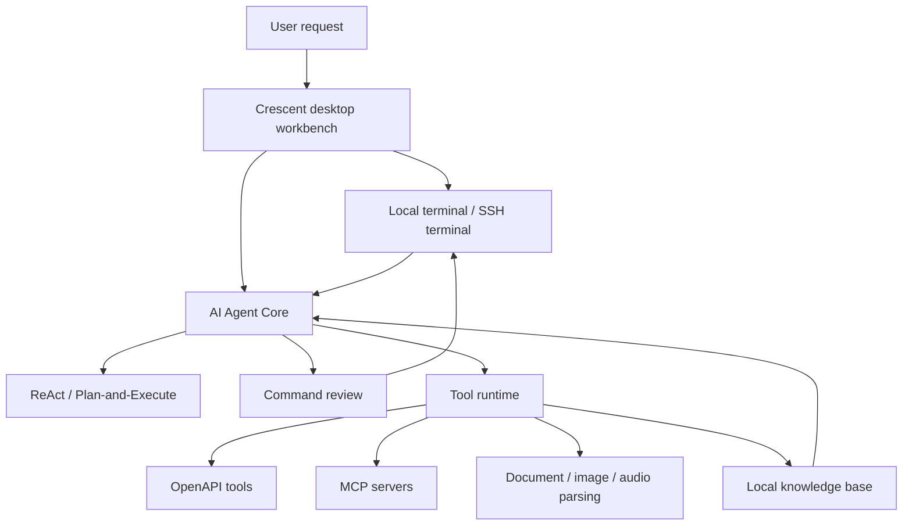

# Crescent

English | [简体中文](./README.zh-CN.md)

An open-source operations workbench that brings AI into the real terminal.

Crescent is a desktop AI command workbench built with Electron, React, and TypeScript. It helps operations engineers, backend developers, and platform teams bring local terminals, SSH connections, AI agents, MCP/OpenAPI tools, and reusable operational knowledge into one focused workspace.

> If you frequently switch between servers, Kubernetes clusters, Docker hosts, and SSH terminals, and you want AI to do more than “suggest commands”, Crescent is designed for that workflow: inspect the real terminal context, execute step by step, review results, and preserve the final knowledge.

## Why Crescent?

Many AI tools can generate shell commands. In real operations and troubleshooting work, the harder problems are different:

- AI does not know which host, cluster, directory, or terminal session you are currently using.
- Generated commands still need manual copy and paste, and command output must be copied back into the chat.
- Risky operations such as file deletion, service restarts, and configuration changes need clear review before execution.
- Troubleshooting knowledge often disappears after the incident is closed.
- OpenAPI tools, MCP tools, terminal commands, and document parsing are usually scattered across different products.

Crescent aims to solve this by keeping AI close to the real terminal and making each step observable, reviewable, and reusable.

## Highlights

### 1. The Terminal Is the Agent's Workspace

Crescent includes an integrated local terminal with PTY support. The Agent can execute commands in the current visible terminal, read real output, and then decide the next step.

Instead of generating a large shell script once, Crescent can work in a closed loop:

1. Understand the user's goal.
2. Inspect the current terminal context.
3. Execute one useful command.
4. Analyze the output.
5. Continue checking, apply a fix, or summarize the result.

For troubleshooting, inspections, and pre-deployment checks, this is much closer to how experienced engineers actually work.

### 2. Built-In Command Review

Crescent adds an independent review step before AI-generated commands are executed. The review explains:

- Why the command is being proposed.
- Whether it may change system, cluster, file, network, service, credential, or data state.
- The risk level.
- Whether user approval is required.
- The likely impact and recommendation.

Clearly read-only checks can be allowed automatically. Mutating or ambiguous commands require confirmation. AI should improve speed, not bypass human judgment.

### 3. Unified Local and SSH Connections

Crescent can read `~/.ssh/config` and also supports custom SSH connections, login actions, SSH options, and password environment variables.

You can switch between local terminals, production hosts, test environments, and other remote machines in one workbench while keeping the Agent grounded in the active connection.

### 4. Skills and Knowledge Base

Crescent includes built-in Skills for common operational tasks, including:

- Linux host inspection.
- Docker environment inspection.
- Kubernetes cluster inspection.
- Kubernetes architecture diagram generation.
- Application service troubleshooting.
- Network connectivity checks.

It also supports local Skill management and a local knowledge base. You can turn troubleshooting records into reusable SOPs and let future Agent runs retrieve that operational knowledge.

This makes Crescent more than a chat interface. It is a workbench for gradually accumulating team knowledge.

### 5. OpenAPI and MCP Tooling

Crescent can load OpenAPI documents and expose operations as Agent tools. It can also connect to custom stdio MCP servers.

This makes it possible to connect internal platforms, CMDB systems, alerting tools, deployment systems, ticketing systems, and other APIs into the same Agent workflow.

## Comparison

| Option | Strength | Limitation | Crescent Difference |
| --- | --- | --- | --- |
| Plain terminal | Direct, reliable, controllable | No AI assistance or context understanding | Embeds an Agent beside the terminal and works from real command output |
| General AI chat | Strong reasoning and explanation | Cannot inspect the live terminal; copy/paste heavy | Connects command execution, output observation, and next-step decisions |
| API testing tools | Good for endpoint validation | Weak for SSH, system troubleshooting, and terminal workflows | Supports OpenAPI tools while preserving terminal-first operations |
| Automation platforms | Strong standardization | Less flexible for exploratory troubleshooting | Lets teams evolve Skills and SOPs gradually |

## Architecture



The core idea is simple: the Agent should not reason away from the worksite. It should gather evidence through the terminal, tools, and knowledge base before making decisions.

## Quick Start

### Install

```bash
npm install
```

### Development

```bash
npm run dev
```

### Build

```bash
# Windows
npm run build:win

# macOS
npm run build:mac

# Linux
npm run build:linux
```

After launch, configure an OpenAI-compatible model provider, select a model, and ask Crescent beside the terminal:

```text
Check the current machine's disk, memory, and system services, then summarize abnormal findings and recommendations.
```

Or:

```text
Connect to production, inspect abnormal Pods in the Kubernetes cluster, and summarize the troubleshooting result.
```

## Who Is It For?

Crescent is especially useful for:

- Operations engineers who troubleshoot through SSH every day.
- SREs responsible for Kubernetes, Docker, and Linux hosts.
- Platform teams that want to turn troubleshooting workflows into SOPs.
- Developers who want to connect internal OpenAPI / MCP tools to an AI Agent.
- Engineers who want AI to operate around real environments instead of only giving suggestions.

## Roadmap

Crescent already includes the core MVP capabilities: local terminal, model provider configuration, OpenAPI tools, ReAct / Plan-and-Execute modes, Agent run panel, command review, Skills, and a knowledge base.

Planned work includes:

- Request timeout, retry controls, and event-log redaction.
- Exportable Agent run traces.
- Multiple API profiles.
- OpenAPI import from local files and remote URLs.
- Prompt templates and pinned workflows.
- Signed cross-platform builds and first-run onboarding.

See [ROADMAP.md](./ROADMAP.md) for details.

## Contributing

If you are looking for an AI terminal workbench built for real operations work, try Crescent and share your feedback.

- GitHub repository: <https://github.com/aide-family/Crescent>
- Bug reports and feature requests: <https://github.com/aide-family/Crescent/issues>

Issues, pull requests, and reusable operational Skills are welcome.

## Recommended IDE

- [VSCode](https://code.visualstudio.com/)
- [ESLint](https://marketplace.visualstudio.com/items?itemName=dbaeumer.vscode-eslint)
- [Prettier](https://marketplace.visualstudio.com/items?itemName=esbenp.prettier-vscode)
