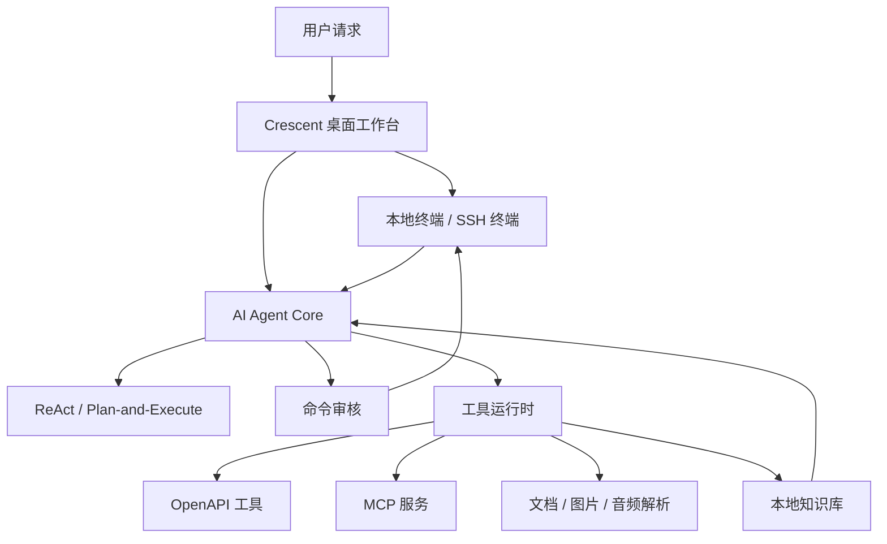

# Crescent

[English](./README.md) | 简体中文

把 AI 真正放进终端里的开源运维工作台。

Crescent 是一个基于 Electron + React + TypeScript 构建的桌面端 AI 命令工作台，帮助运维、后端和平台工程师把本地终端、SSH 连接、AI Agent、MCP/OpenAPI 工具和知识库沉淀整合到一个界面里。

> 如果你经常在服务器、Kubernetes、Docker、SSH 终端之间来回切换，又希望 AI 不只是“给建议”，而是能基于真实终端上下文一步步帮你检查、执行、复盘，Crescent 正是为这种工作流设计的。

## 为什么需要 Crescent？

现在很多 AI 工具都能生成命令，但真正落到运维和排障场景里，问题往往不是“AI 会不会写命令”，而是：

- AI 不知道你当前终端在哪台机器、哪个集群、哪个目录。
- AI 生成的命令需要手动复制粘贴，执行结果又要再复制回去。
- 一旦涉及删除文件、重启服务、修改配置，风险很难被提前解释清楚。
- 排障过程做完就散了，下次遇到类似问题还要从头来。
- OpenAPI、MCP、终端命令、文档解析各自分散，很难形成一个连续工作流。

Crescent 想解决的就是这个问题：让 AI 贴着真实终端工作，并把每一步变成可观察、可审核、可复用的操作过程。

## 核心亮点

### 1. 终端不是旁边的黑框，而是 Agent 的工作现场

Crescent 内置本地终端能力，支持 PTY，并能让 Agent 在当前可见终端中执行命令、读取真实输出，再决定下一步操作。

它不是简单地生成一段 shell，而是可以按类似 ReAct 的方式闭环推进：

1. 理解用户目标。
2. 查看当前终端上下文。
3. 执行一个必要命令。
4. 分析输出。
5. 决定继续检查、修复，还是总结结果。

对排障、巡检、部署前检查这类任务来说，这比一次性生成大段命令更接近真实工程师的工作方式。

### 2. 内置命令审核，避免 AI 命令直接裸跑

Crescent 对 AI 生成的命令加入了独立审核机制，会分析：

- 这条命令为什么要执行。
- 是否会修改系统、集群、文件、网络或服务状态。
- 风险等级是低、中还是高。
- 是否需要用户批准。
- 潜在影响和建议是什么。

只读检查可以自动放行，涉及删除、重启、提权、写文件、改配置等操作时会要求确认。AI 可以提效，但不应该绕过人的判断。

### 3. SSH 连接和本地连接统一管理

Crescent 可以读取 `~/.ssh/config`，也支持自定义 SSH 连接、登录动作、SSH 参数、密码环境变量等配置。

你可以在一个工作台里切换本地终端、生产机器、测试环境或其他远程主机，并让 Agent 基于当前连接继续做检查。

### 4. Skills + 知识库，把经验沉淀成可复用工作流

项目内置了系统 Skill，例如：

- Linux 基础环境巡检。
- Docker 环境检查。
- Kubernetes 集群巡检。
- Kubernetes 架构图生成。
- 应用服务排查。
- 网络连通性检查。

Crescent 还支持本地 Skill 管理和知识库沉淀。你可以把一次排障记录整理成 SOP，保存到本地知识库，后续 Agent 可以检索并参考这些经验。

这让 Crescent 不只是会话工具，而更像一个面向团队经验复用的运维工作台。

### 5. 支持 OpenAPI 和 MCP，把外部系统变成 Agent 工具

Crescent 支持加载 OpenAPI 文档生成函数工具，也支持配置 stdio MCP 服务，让 Agent 在终端之外调用外部工具。

这类能力适合把内部平台、CMDB、告警系统、发布系统、工单系统等接进来，形成更完整的自动化工作流。

## 方案对比

| 方案             | 优点             | 局限                                 | Crescent 的差异                                      |
| ---------------- | ---------------- | ------------------------------------ | ---------------------------------------------------- |
| 普通终端         | 直接、可靠、可控 | 没有 AI 辅助和上下文理解             | 在终端旁边嵌入 Agent，并基于真实输出闭环执行         |
| 通用 AI 聊天工具 | 推理和解释能力强 | 不能直接读取终端状态，复制粘贴成本高 | 把命令执行、结果观察和下一步决策串起来               |
| API 调试工具     | 适合接口验证     | 不擅长 SSH、系统排障和终端操作       | 支持 OpenAPI 工具，同时保留终端工作流                |
| 自动化脚本平台   | 标准化强         | 灵活排障能力弱，前期沉淀成本高       | 用 Skills/SOP 逐步沉淀经验，不要求一开始就写完整平台 |

## 架构概览



这个设计的核心是：Agent 不脱离现场做判断，而是通过终端、工具和知识库不断补充证据。

## 快速上手

### 从 GitHub Release 安装（推荐普通用户）

从 [Releases](https://github.com/aide-family/Crescent/releases) 下载对应平台安装包：

| 平台 | 推荐资产 |
| --- | --- |
| macOS Apple Silicon | `crescent-*-arm64.dmg` 或 Universal |
| macOS Intel | `crescent-*-x64.dmg` 或 Universal |
| Windows | `crescent-*-x64-setup.exe` |
| Linux | `.AppImage` 或 `.deb` |

建议先用 Release 中的 `SHA256SUMS.txt` 校验下载文件。

#### macOS：「已损坏，无法打开」

在仓库配置签名密钥之前，部分正式包可能仍未签名。详见 [docs/CODE_SIGNING.md](./docs/CODE_SIGNING.md)。从浏览器下载后，Gatekeeper 可能提示 **「Crescent」已损坏，无法打开**。这不是安装包损坏，可按下面步骤解除隔离后再打开：

1. 将 `Crescent.app` 拖到「应用程序」。
2. 在终端执行：

```bash
xattr -cr /Applications/Crescent.app
```

3. 再双击打开应用。

也可在「系统设置 → 隐私与安全性」中查看是否有「仍要打开」选项；若仍无法启动，优先使用上面的 `xattr` 命令。

### 从源码安装依赖

```bash
npm install
```

### 开发模式

```bash
npm run dev
```

### 构建桌面端

```bash
# Windows（可在 macOS/Linux 上交叉打包；依赖 node-pty 自带的 win32 prebuilds）
npm run build:win

# macOS
npm run build:mac

# Linux
npm run build:linux
```

说明：

- `node-pty` 使用官方 N-API prebuilds，打包时关闭 `npmRebuild`，避免在 macOS 上交叉编译 Windows/Linux 原生模块失败。
- 正式发版由 GitHub Actions 在对应系统上构建（见 `.github/workflows/release.yml`）。
- 若本机打 Windows NSIS 安装包时提示缺少 Wine，可改用 CI，或安装 Wine 后再打包。

启动后，你可以配置 OpenAI 兼容模型供应商，选择模型，然后在终端旁边直接向 Crescent 提问，例如：

```text
检查当前机器的磁盘、内存、系统服务状态，并给出异常项和建议。
```

或者：

```text
连接 production，检查 Kubernetes 集群里异常 Pod，并整理一份排障结论。
```

## 适合谁使用？

Crescent 特别适合这些人：

- 经常通过 SSH 排查问题的运维工程师。
- 负责 Kubernetes、Docker、Linux 主机的 SRE。
- 需要把排障流程沉淀成 SOP 的平台团队。
- 想把内部 OpenAPI / MCP 工具接入 AI Agent 的开发者。
- 不满足于“AI 只给建议”，希望 AI 能围绕真实环境闭环工作的工程师。

## Roadmap

Crescent 目前已经具备可用 MVP 的核心能力：本地终端、模型配置、OpenAPI 工具、ReAct / Plan-and-Execute、Agent 运行面板、命令审核、Skills 和知识库等。

Phase 1–4 产品与分发基础设施已就绪：基于 GitHub Releases 的应用内更新、打包冒烟检查，以及在配置证书密钥后由 CI 执行签名/公证（见 [docs/CODE_SIGNING.md](./docs/CODE_SIGNING.md)）。

更多细节见 [ROADMAP.md](./ROADMAP.md)。

## 参与贡献

如果你正在寻找一个面向真实运维场景的 AI 终端工作台，欢迎 Star、试用和反馈。

- GitHub 仓库：<https://github.com/aide-family/Crescent>
- Bug / 需求反馈：<https://github.com/aide-family/Crescent/issues>

欢迎提交 Issue、PR，或者把你的常用排障流程整理成 Skill，一起把 Crescent 打磨成更好用的开源工程师工作台。

## 推荐 IDE

- [VSCode](https://code.visualstudio.com/)
- [ESLint](https://marketplace.visualstudio.com/items?itemName=dbaeumer.vscode-eslint)
- [Prettier](https://marketplace.visualstudio.com/items?itemName=esbenp.prettier-vscode)
