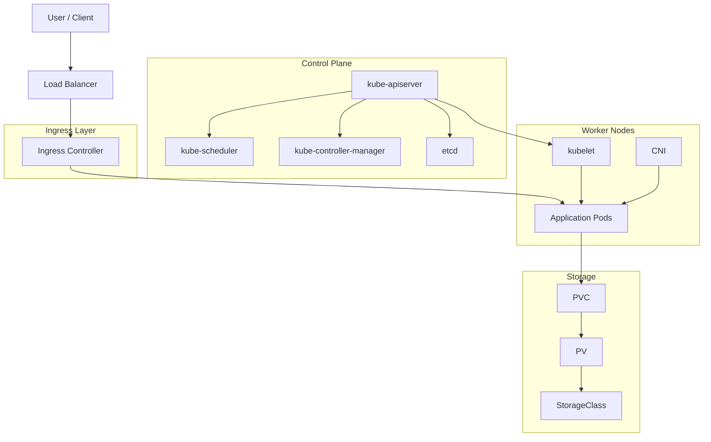

# Kubernetes Cluster Architecture Mermaid Mapping

Use this skill when the user asks to map, document, review, explain, or visualize Kubernetes or K8s cluster architecture, especially when the expected output is a Mermaid diagram.

## Safety Rules

1. Use read-only discovery first. Do not create, edit, delete, restart, drain, scale, patch, or apply resources unless the user explicitly asks for a follow-up change.
2. Confirm the active context before collecting cluster data. If the active context is unclear or risky, ask the user to confirm.
3. Do not infer topology as fact without evidence. Mark missing or unverified parts as `Unknown` or list them under open questions.
4. Keep commands bounded. Prefer `kubectl get`, `kubectl describe`, `kubectl config current-context`, `kubectl api-resources`, and narrowly scoped log or event checks only when needed.
5. If a report file is requested and no local Crescent client-machine path is provided, summarize first and ask for a destination before writing.

## Evidence Collection

Collect enough evidence to describe the architecture without overloading the user or the cluster:

- Cluster context, server version, API resources, and node list with roles, zones, internal IPs, kernel, OS image, and container runtime.
- Control-plane shape: control-plane nodes, API server, scheduler, controller manager, etcd, cloud-controller-manager if present, and high-availability indicators.
- System namespaces and add-ons: CoreDNS, CNI, ingress controller, metrics, logging, monitoring, certificate, storage, and backup components.
- Workload topology: important namespaces, Deployments, StatefulSets, DaemonSets, Jobs, Services, Endpoints, Ingresses, and gateway resources.
- Network path: ingress or load balancer entrypoints, service routing, CNI plugin, DNS path, network policies, and external-facing services.
- Storage path: StorageClass, PV, PVC, CSI drivers, local volumes, object storage, database volumes, and backup storage.
- Observability path: metrics, logs, traces, alerting, dashboards, and log collectors if present.
- External dependencies: databases, message queues, registries, object stores, external APIs, identity providers, and DNS or load balancer systems.

## Suggested Read-Only Commands

Use a minimal relevant subset based on the user's request:

```bash
kubectl config current-context
kubectl version
kubectl get nodes -o wide
kubectl get namespaces
kubectl get pods -A -o wide
kubectl get deploy,sts,ds,job,cronjob -A
kubectl get svc,endpoints,ingress -A
kubectl get storageclass,pv
kubectl get pvc -A
kubectl get networkpolicy -A
kubectl get events -A --sort-by=.lastTimestamp
kubectl get pods -n kube-system -o wide
kubectl get pods -A -l app.kubernetes.io/name
```

Before using CRD-specific commands, check availability:

```bash
kubectl api-resources
```

## Architecture Reasoning

1. Start with the user-facing traffic path, then map inward to service routing, workloads, storage, and dependencies.
2. Separate platform components from business workloads.
3. Group related resources by namespace, tier, or responsibility.
4. Prefer verified names from Kubernetes resources. Use generic labels only for missing evidence.
5. Note HA and single-point-of-failure signals explicitly, such as one control-plane node, single ingress replica, single CoreDNS replica, or local-only storage.

## Mermaid Output Rules

1. Always provide at least one Mermaid code block when the task asks for architecture visualization.
2. Prefer `flowchart TD` for cluster architecture. Use `sequenceDiagram` only for request flows.
3. Use stable ASCII node IDs and quoted labels, for example `api["kube-apiserver"]`.
4. Use `subgraph` blocks to keep diagrams readable:
   - `Client / External`
   - `Ingress Layer`
   - `Control Plane`
   - `Worker Nodes`
   - `Application Namespaces`
   - `Storage`
   - `Observability`
   - `External Dependencies`
5. Keep each diagram focused. If the topology is large, split it into platform, application traffic, and storage/observability diagrams.
6. Avoid overly long labels. Put detailed findings outside the diagram.
7. Include unknown or unverified parts as dashed or clearly labeled nodes when they matter.

Example:



## Final Response

Return:

1. Architecture summary: cluster context, main layers, and verified components.
2. Mermaid diagram block.
3. Evidence used: concise command list or resource signals.
4. Risks and unknowns: missing evidence, suspected single points of failure, or parts requiring confirmation.
5. Suggested next steps only when useful, such as collecting CRD details, adding a request-flow diagram, or exporting a report.
