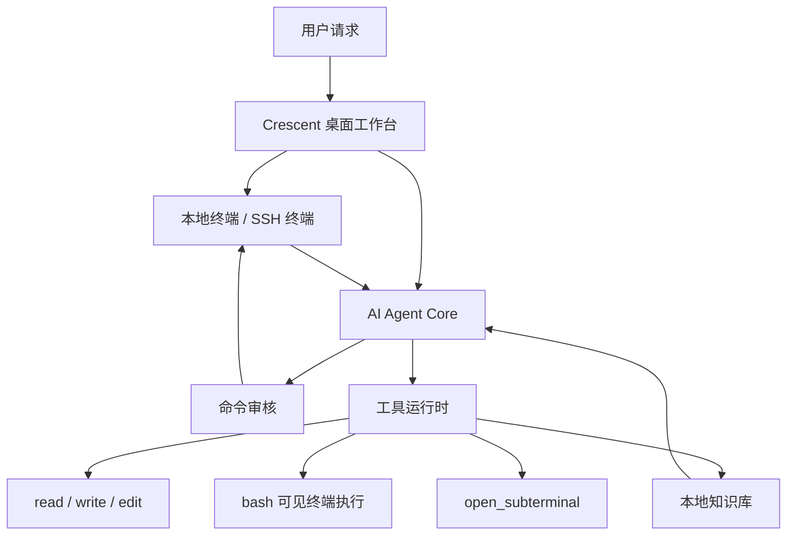

# 运行时与适用人群

Crescent 是 Electron、React 和 TypeScript 桌面工作台。Agent 不脱离现场做判断，而是通过终端、工具和知识库补充证据。

进程边界、IPC 和当前重构顺序写在仓库 [docs/ARCHITECTURE.md](https://github.com/aide-family/Crescent/blob/main/docs/ARCHITECTURE.md)。那份文档是工程说明，这里只描述使用时能看到的关系。

## 适合谁

- 每天通过 SSH 排障的运维工程师
- 负责 Kubernetes、Docker 和 Linux 主机的 SRE
- 要把排障流程沉淀成 SOP 的平台团队
- 希望 Agent 贴着真实终端、并且命令可审核的开发者
- 不满足于“只给建议”、希望围绕真实环境闭环工作的工程师
