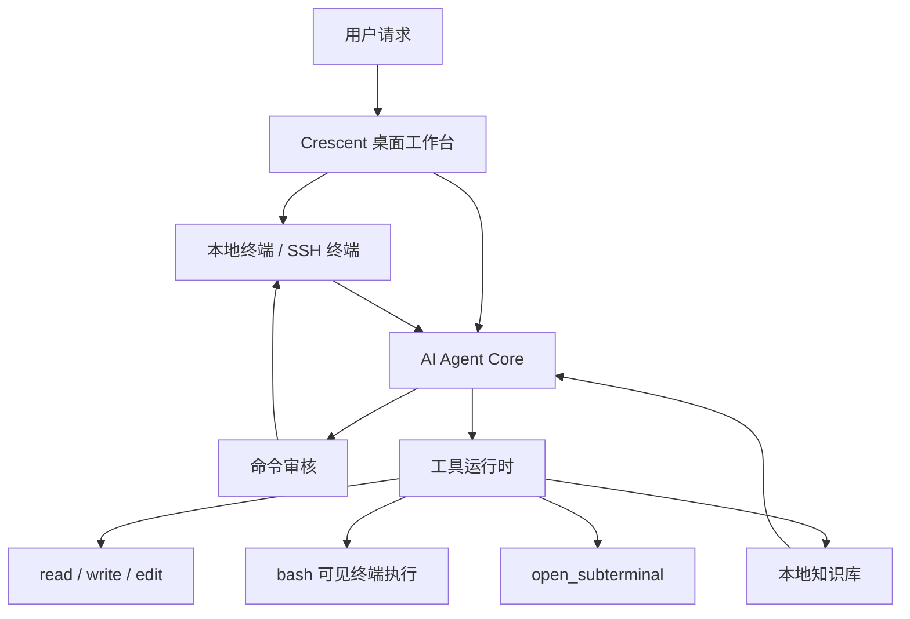
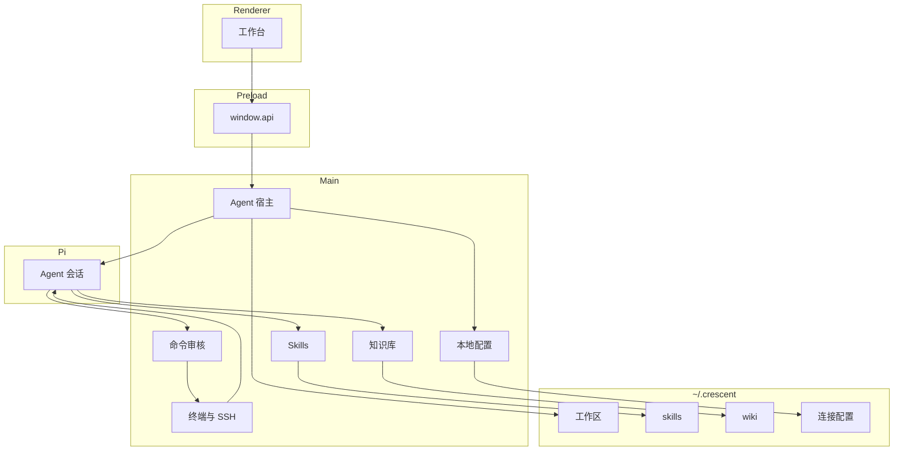
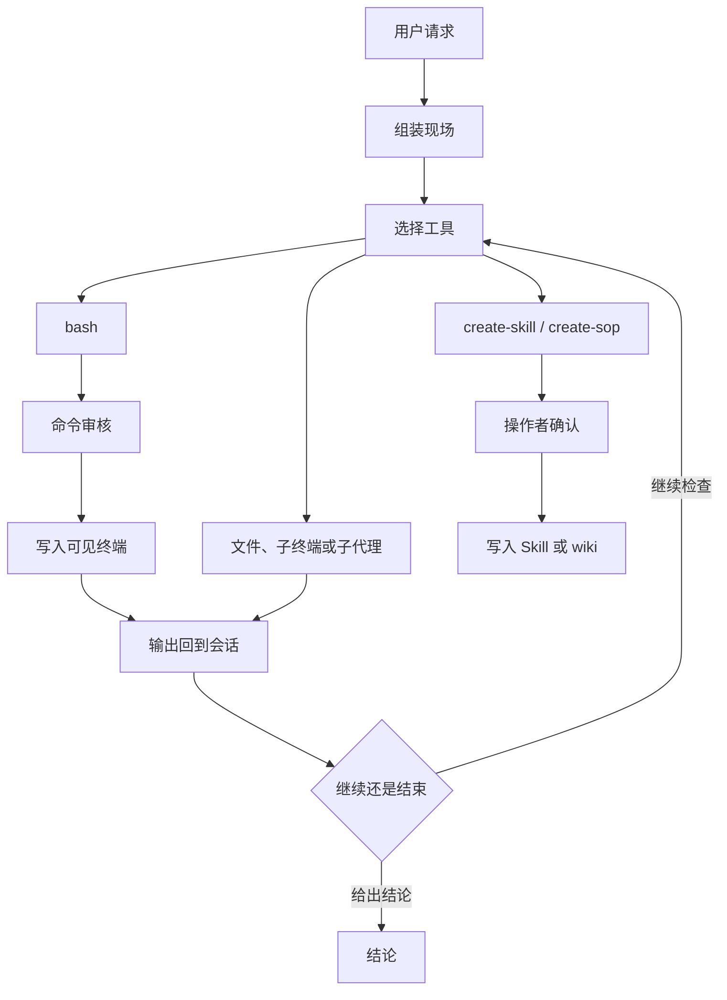

# 运行时与适用人群

Crescent 是 Electron、React 和 TypeScript 桌面工作台。Agent 不脱离现场做判断，而是通过终端、工具和知识库补充证据。

## 使用关系

```mermaid
flowchart TD
  user["用户请求"] --> ui["Crescent 桌面工作台"]
  ui --> terminal["本地终端 / SSH 终端"]
  ui --> agent["AI Agent Core"]
  agent --> audit["命令审核"]
  audit --> terminal
  agent --> tools["工具运行时"]
  tools --> files["read / write / edit"]
  tools --> bash["bash 可见终端执行"]
  tools --> subterm["open_subterminal"]
  tools --> wiki["本地知识库"]
  wiki --> agent
  terminal --> agent
```

进程边界、IPC 和当前重构顺序写在仓库 [docs/ARCHITECTURE.md](https://github.com/aide-family/Crescent/blob/main/docs/ARCHITECTURE.md)。那份文档是工程说明，这里只描述使用时能看到的关系。

## 系统架构 {#system}

工作台跑在 Renderer。它不直接碰终端、文件或密钥，只通过 Preload 暴露的 `window.api` 把请求交给 Main。

Main 持有终端和 SSH、命令审核、Skills、知识库，以及连接等本地配置。Pi 是客座运行时：它跑 Agent 会话，通过宿主注册的工具回到终端和沉淀，不单独持有 SSH 或密钥。

```mermaid
flowchart TB
  subgraph renderer [Renderer]
    workbench["工作台"]
  end
  subgraph preload [Preload]
    bridge["window.api"]
  end
  subgraph mainProc [Main]
    host["Agent 宿主"]
    terminalNode["终端与 SSH"]
    review["命令审核"]
    skills["Skills"]
    wiki["知识库"]
    config["本地配置"]
  end
  subgraph pi [Pi]
    session["Agent 会话"]
  end
  subgraph disk ["~/.crescent"]
    workspace["工作区"]
    skillDir["skills"]
    wikiDir["wiki"]
    connections["连接配置"]
  end
  workbench --> bridge --> host
  host --> session
  session --> review
  review --> terminalNode
  session --> skills
  session --> wiki
  terminalNode --> session
  skills --> skillDir
  wiki --> wikiDir
  host --> config
  config --> connections
  host --> workspace
```

本地数据留在 `~/.crescent`：Agent 工作区、Skill 目录、知识库，以及已保存的连接。

## 主工作流 {#workflow}

一次排障从工作台进入宿主，在可见终端里收束，需要留下做法时再确认落盘。

```mermaid
flowchart TD
  request["用户请求"] --> context["组装现场"]
  context --> choose["选择工具"]
  choose --> bash["bash"]
  choose --> other["文件、子终端或子代理"]
  choose --> capture["create-skill / create-sop"]
  bash --> review["命令审核"]
  review --> visible["写入可见终端"]
  visible --> output["输出回到会话"]
  other --> output
  output --> decide{"继续还是结束"}
  decide -->|"继续检查"| choose
  decide -->|"给出结论"| done["结论"]
  capture --> confirm["操作者确认"]
  confirm --> persist["写入 Skill 或 wiki"]
```

1. 请求从工作台进入宿主。宿主按当前终端、已加载的 Skills 和知识库组装这次运行的现场。
2. Pi 会话选择下一步工具。文件工具只动工作区。跨机器或另一条检查线用子终端或子代理，说明见 [子终端与子代理](/guide/subagents)。
3. `bash` 先经过 [命令审核](/guide/command-review)，通过后才写入当前可见终端。输出回到会话，供下一步判断。终端侧的逐步说明见 [终端与 Agent](/guide/terminal#flow)。
4. 会话可以继续检查，也可以给出结论。
5. 若要把这次做法留下，调用 `create-skill` 或 `create-sop`。宿主只生成草稿，确认之后才写入。见 [Skills 与知识库](/guide/skills#flow)。

## 适合谁

- 每天通过 SSH 排障的运维工程师
- 负责 Kubernetes、Docker 和 Linux 主机的 SRE
- 要把排障流程沉淀成 SOP 的平台团队
- 希望 Agent 贴着真实终端、并且命令可审核的开发者
- 不满足于“只给建议”、希望围绕真实环境闭环工作的工程师
