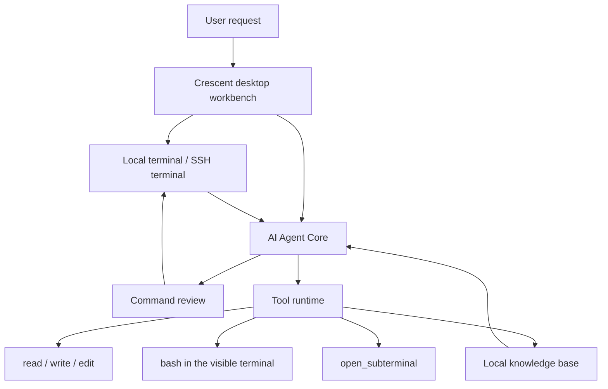

# Runtime and audience

Crescent is an Electron, React, and TypeScript desktop workbench. The Agent should not reason away from the worksite. It gathers evidence through the terminal, tools, and knowledge base.

Process boundaries, IPC, and the current refactoring order live in [docs/ARCHITECTURE.md](https://github.com/aide-family/Crescent/blob/main/docs/ARCHITECTURE.md). That file is the engineering note. This page describes the relationship you see while using the app.

## Who it is for

- Operations engineers who troubleshoot through SSH every day
- SREs responsible for Kubernetes, Docker, and Linux hosts
- Platform teams that want troubleshooting workflows saved as SOPs
- Developers who want an Agent grounded in a real terminal, with reviewable commands
- Engineers who want AI to work around real environments instead of only suggesting commands
