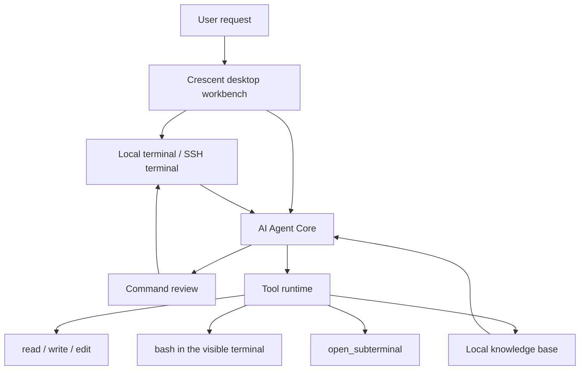
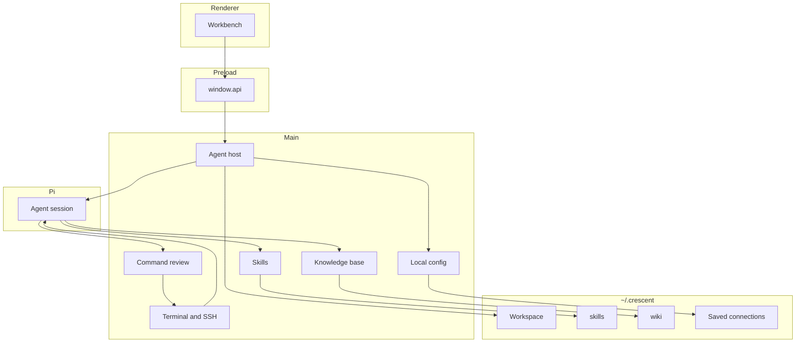
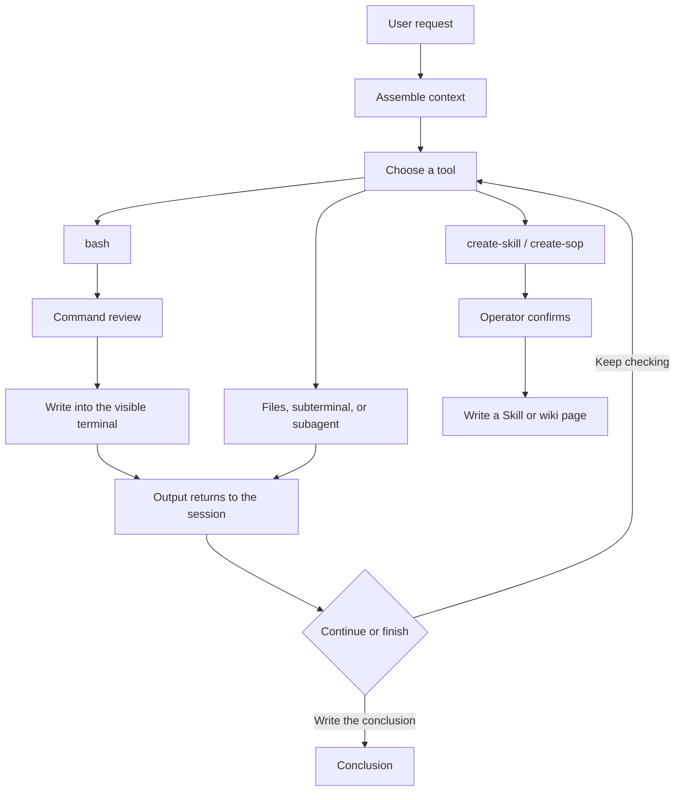

# Runtime and audience

Crescent is an Electron, React, and TypeScript desktop workbench. The Agent should not reason away from the worksite. It gathers evidence through the terminal, tools, and knowledge base.

## What you see

```mermaid
flowchart TD
  user["User request"] --> ui["Crescent desktop workbench"]
  ui --> terminal["Local terminal / SSH terminal"]
  ui --> agent["AI Agent Core"]
  agent --> audit["Command review"]
  audit --> terminal
  agent --> tools["Tool runtime"]
  tools --> files["read / write / edit"]
  tools --> bash["bash in the visible terminal"]
  tools --> subterm["open_subterminal"]
  tools --> wiki["Local knowledge base"]
  wiki --> agent
  terminal --> agent
```

Process boundaries, IPC, and the current refactoring order live in [docs/ARCHITECTURE.md](https://github.com/aide-family/Crescent/blob/main/docs/ARCHITECTURE.md). That file is the engineering note. This page describes the relationship you see while using the app.

## System architecture {#system}

The workbench runs in the Renderer. It does not touch the terminal, files, or secrets directly. It sends requests through `window.api`, which the Preload exposes, and Main handles them.

Main owns the terminal and SSH, command review, Skills, the knowledge base, and local configuration such as saved connections. Pi is the guest runtime: it runs the Agent session and returns to the terminal and capture tools through tools the host registers. It does not hold SSH sessions or secrets on its own.

```mermaid
flowchart TB
  subgraph renderer [Renderer]
    workbench["Workbench"]
  end
  subgraph preload [Preload]
    bridge["window.api"]
  end
  subgraph mainProc [Main]
    host["Agent host"]
    terminalNode["Terminal and SSH"]
    review["Command review"]
    skills["Skills"]
    wiki["Knowledge base"]
    config["Local config"]
  end
  subgraph pi [Pi]
    session["Agent session"]
  end
  subgraph disk ["~/.crescent"]
    workspace["Workspace"]
    skillDir["skills"]
    wikiDir["wiki"]
    connections["Saved connections"]
  end
  workbench --> bridge --> host
  host --> session
  session --> review
  review --> terminalNode
  session --> skills
  session --> wiki
  terminalNode --> session
  skills --> skillDir
  wiki --> wikiDir
  host --> config
  config --> connections
  host --> workspace
```

Local data stays in `~/.crescent`: the Agent workspace, the Skill directory, the knowledge base, and saved connections.

## Main workflow {#workflow}

A troubleshooting run enters through the workbench, closes on the visible terminal, and is written to disk only after you confirm a capture.

```mermaid
flowchart TD
  request["User request"] --> context["Assemble context"]
  context --> choose["Choose a tool"]
  choose --> bash["bash"]
  choose --> other["Files, subterminal, or subagent"]
  choose --> capture["create-skill / create-sop"]
  bash --> review["Command review"]
  review --> visible["Write into the visible terminal"]
  visible --> output["Output returns to the session"]
  other --> output
  output --> decide{"Continue or finish"}
  decide -->|"Keep checking"| choose
  decide -->|"Write the conclusion"| done["Conclusion"]
  capture --> confirm["Operator confirms"]
  confirm --> persist["Write a Skill or wiki page"]
```

1. The request enters the host from the workbench. The host assembles this run from the current terminal, loaded Skills, and the knowledge base.
2. The Pi session picks the next tool. File tools stay inside the workspace. Another machine or a separate line of checks uses a subterminal or a subagent. See [Subterminals and subagents](/en/guide/subagents).
3. `bash` goes through [command review](/en/guide/command-review) before it is written into the visible terminal. Output returns to the session for the next decision. The terminal-side steps are in [Terminal and Agent](/en/guide/terminal#flow).
4. The session can keep checking, or it can write the conclusion.
5. To keep the practice, call `create-skill` or `create-sop`. The host only drafts the text. It is written after you confirm. See [Skills and knowledge](/en/guide/skills#flow).

## Who it is for

- Operations engineers who troubleshoot through SSH every day
- SREs responsible for Kubernetes, Docker, and Linux hosts
- Platform teams that want troubleshooting workflows saved as SOPs
- Developers who want an Agent grounded in a real terminal, with reviewable commands
- Engineers who want AI to work around real environments instead of only suggesting commands
