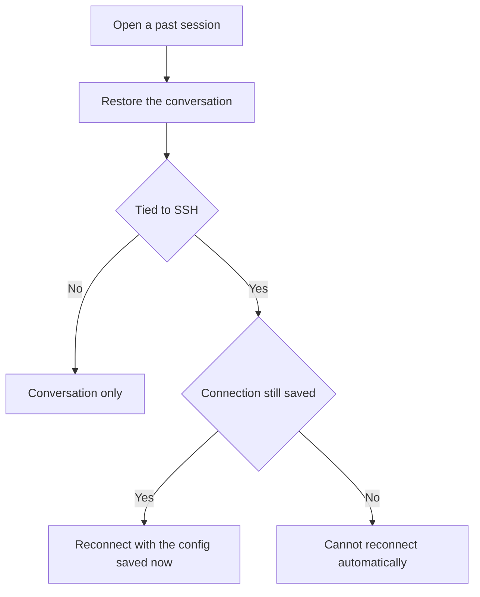

# Session history

Session history keeps the conversation with the Agent. Opening a past session restores that conversation.

## Flow {#flow}

If the session was tied to an SSH connection, Crescent opens the terminal again and logs in with the **connection as it is saved now**, not with a password or temporary environment from that earlier run. If that connection has been deleted, Crescent cannot reconnect automatically. Add the host again under [SSH connections](/en/guide/ssh).

You can rename a history title. One session can contain several Agent runs, and the list shows how many.
