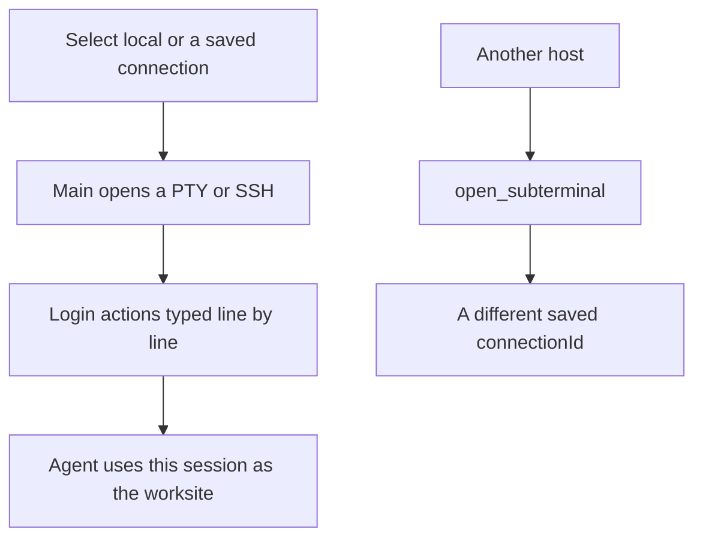

# SSH connections

Crescent can read `~/.ssh/config`. It also supports custom SSH connections, login actions, SSH options, and password environment variables.

Switch among these in one workbench:

- Local terminal
- Test environments
- Production hosts
- Other remote machines

The Agent treats the selected connection as the worksite. After you change hosts, later commands run in the new session.

To inspect another host in parallel, use `open_subterminal` from [Subterminals and subagents](/en/guide/subagents) and dock a dedicated local or SSH terminal.

## Flow {#flow}

After you select a connection, Main opens a local PTY or an SSH session. Login actions on that connection are typed in one line at a time. Later Agent commands run in that session.

To watch another host at the same time, do not open a subterminal for the connection you are already on. `open_subterminal` with `mode=ssh` must use a different saved `connectionId`.

## Login actions

A custom connection can include login actions. After SSH starts, Crescent types those lines into the terminal, one line at a time, in the order you wrote. Use this for `sudo -i`, a directory change, or a second hop inside a bastion. Keep passwords in environment variables, not in the action text.

## Cluster host match

An optional cluster host pattern says whether the terminal’s hostname is already inside the target environment. Use a glob such as `*.gd17.*`, or a regular expression such as `^node-\d+$`. A pattern that is too long or too complex is rejected when you save.

## Organizing the list

You can favorite a connection, copy it as JSON and import that as a new connection, and move entries up, down, to the top, or to the bottom. The default entry is the local terminal. After you select another connection, the Agent treats that connection as the worksite.
