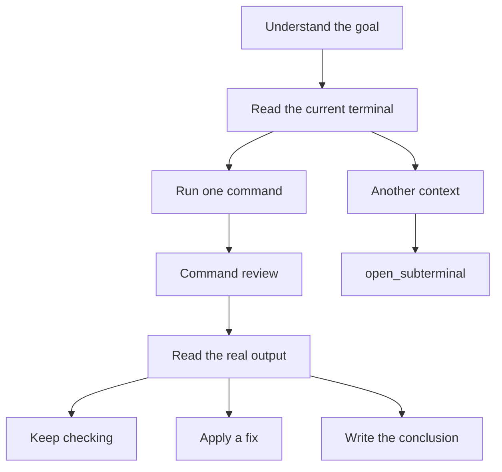

# Terminal and Agent

Crescent includes a local terminal with PTY support. The Agent executes in the **visible terminal** and reads real output. The terminal is the workspace, not a side pane for pasted commands.

That means:

- You can see the command that is running and its output.
- The next step is based on that output, not on a guessed environment.
- For another host or another context, `open_subterminal` docks a dedicated pane instead of mixing every command into one session.

## Flow {#flow}

A command passes [command review](/en/guide/command-review#flow) before it reaches the terminal. Another host or a separate line of checks should not share the main pane’s PTY. Use [Subterminals and subagents](/en/guide/subagents#flow).

## Tasks that fit

- Local checks of disk, memory, and services
- Pre-deployment checks
- Narrowing a failure from the previous command’s output

For another machine, select it under [SSH connections](/en/guide/ssh) first, then continue the Agent run on that connection. A parallel line of checks uses [Subterminals and subagents](/en/guide/subagents) instead of sharing the main pane’s PTY.
