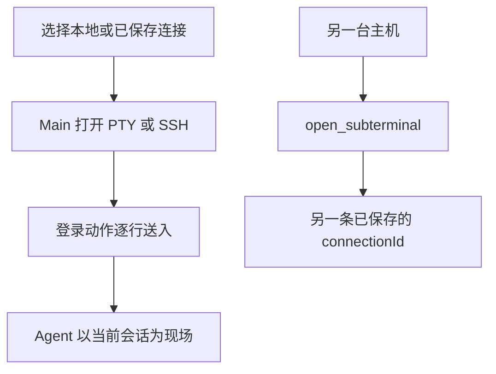

# SSH 连接

Crescent 可以读取 `~/.ssh/config`，也支持自定义 SSH 连接、登录动作、SSH 参数和密码环境变量。

在同一个工作台里切换：

- 本地终端
- 测试环境
- 生产主机
- 其他远程机器

Agent 以当前选中的连接为现场。换一台机器后再提问，后续命令会落在新的会话上，而不是沿用上一个主机的假设。

需要并行查看另一台主机时，使用 [子终端与子代理](/guide/subagents) 里的 `open_subterminal`，把专用本地或 SSH 终端停靠出来。

## 流程 {#flow}

选中一条连接后，Main 打开本地 PTY 或 SSH 会话。连接上如果写了登录动作，会按行送进终端。之后的 Agent 命令落在这个会话上。

要同时看另一台主机时，不要对当前这条连接再开一个子终端。`open_subterminal` 的 `mode=ssh` 必须带另一条已经保存的 `connectionId`。

## 登录动作

自定义连接可以附上登录动作。SSH 启动后，Crescent 按行把这些输入送进终端，一行一条，按你写的顺序执行。适合登录后还要 `sudo -i`、切换目录或进入跳板机内层主机的情况。密码放在环境变量里，不要写进动作文本。

## 集群主机匹配

可选的集群主机模式用来判断终端主机名是不是已经落在目标环境。可以用 glob（例如 `*.gd17.*`）或正则（例如 `^node-\d+$`）。模式过长或过于复杂时，保存会被拒绝。

## 整理连接列表

连接可以收藏、复制成 JSON 再导入为新连接，也可以上移、下移、置顶和置底。列表里的默认项是本地终端。选中另一条连接后再提问，Agent 以新连接为现场。
